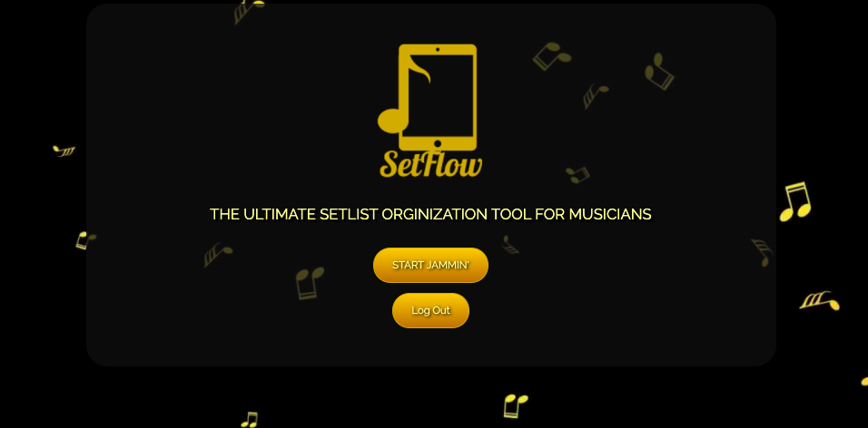
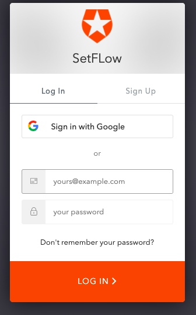
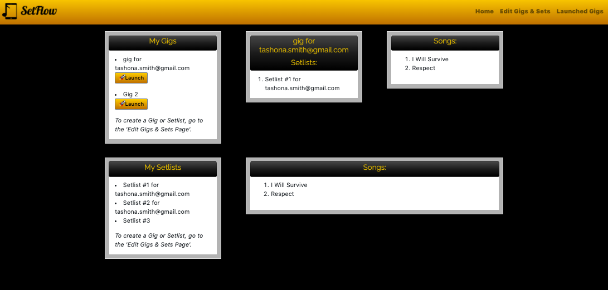
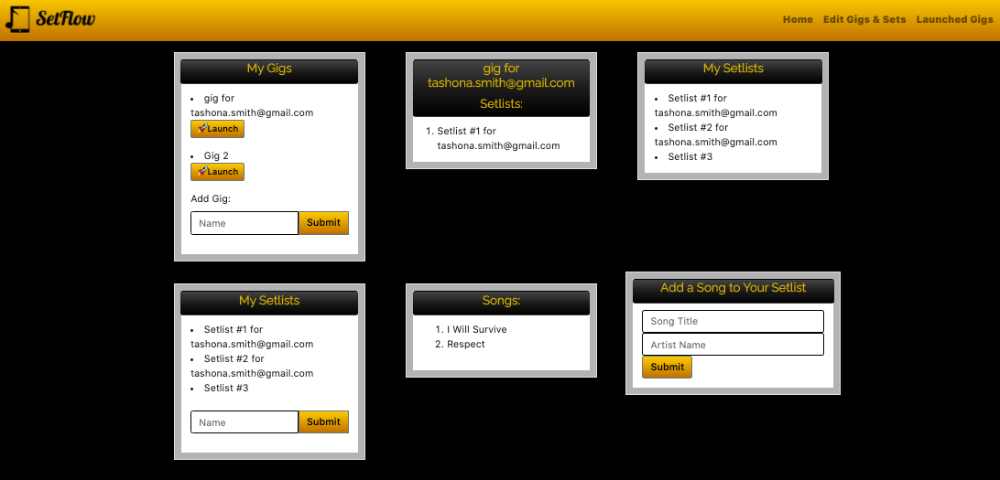
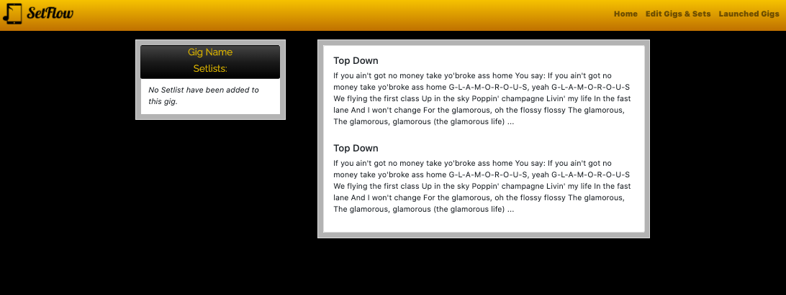

# SetFlow

SetFlow is an app that enables musicians to create and organize setlists more efficiently than ever.  Users can set up separate Gigs, with multiple Setlists for each Gig.  Instantly retrieve lyrics via the API Seeds Lyrics API to implement into your Setlists.  Don’t waste any more time searching for, copying, and pasting lyrics, or printing out paper copies that can easily be lost or mixed up during live performances.  SetFlow makes it simple and convenient to create and organize your setlists and lyrics, and can easily be used on any computer or mobile device during live performances.

Created using:
React.js, Express.js, Particles.js, Axios, Auth0, MongoDB, API Seeds Lyrics API, reactstrap

On the landing page, click the "Start Jammin'" button to create your account, or sign in to your existing account.  The option to sign in via your Google account is provided via Auth0.

On the Main Page/Dashboard, you can view all Gigs, all Setlists, Setlists for a specific Gig, and all Songs contained within each Setlist.  Use the "Launch" button to launch a Gig and view all Setlists and Songs for that specific Gig.

On the Edit Gigs & Sets page, you can add Gigs, Setlists and new Songs.  Use the "Launch" button to launch a Gig and view all Setlists and Songs for that specific Gig.

On the Launched Gigs page, view all Setlists and Songs for the currently launched Gig.

